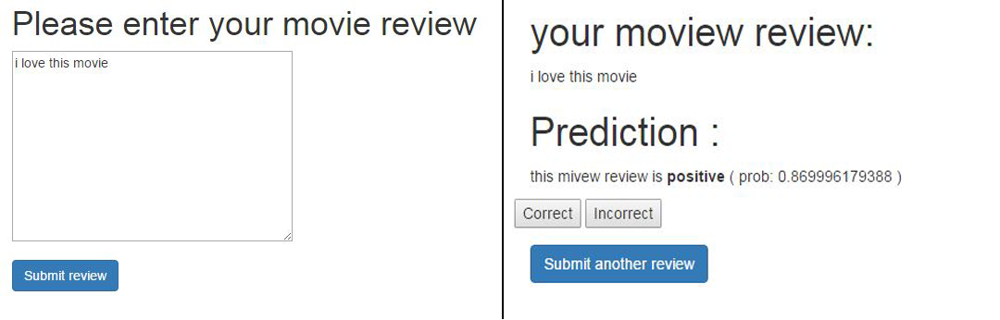

## Embedding a Machine Learning Model into a Web Application

[pythonmllink]:https://www.amazon.com/Python-Machine-Learning-Sebastian-Raschka/dp/1783555130
[Python Machine Learning][pythonmllink] 이라는 책의 CH9 부분입니다.

긍/부정의 결과가 주어져 있는 영화 리뷰 데이터를 사용해 Scikit-learn을 통해 학습시킨후 pickle 을 통해 서버에 저장한 뒤

사용자가 새롭게 입력한 리뷰 데이터를 웹상에서 긍/부정으로 분류한 결과를 출력하고 

Scikit-learn의 partial-fit 을 사용해 db상에 저장될 때마다 실시간으로 모델에 새로운 데이터를 학습 시키는 예제입니다.

머신러닝 모델을 위해 Reddis 등을 많이 사용하지만 partial-fit 을 사용가능한 모델은 pickle 과 partial-fit 을 통해 실시간으로 학습 가능합니다.

책에서 Flask 프레임워크를 이용했지만 이를 Django 프레임워크로 다시 코딩 했습니다.

# 사용된 라이브러리

1) Scikit-learn 

      긍/부정 예측모델을 위한 머신러닝 라이브러리
     
2) Nltk

      NLP 를 위한 라이브러리로 텍스트 데이터 전처리에 사용
     
3) Django

      웹프레임워크

# 최종결과

## [튜토리얼](./python_ml_ch9.ipynb)
